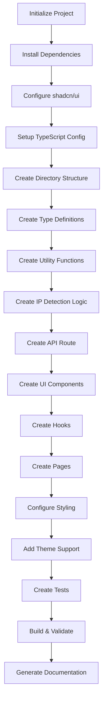

# AI AGENT INSTRUCTION SET: "What's My IP" Application
**Version:** 2.0  
**Target:** Autonomous AI agents or agent swarms  
**Execution Mode:** Sequential or parallel (where dependencies allow)  
**Estimated Tokens Required:** ~150K for complete codebase generation

---

## AGENT EXECUTION FRAMEWORK

### 1. EXECUTION PRINCIPLES
```yaml
mode: strict_adherence
validation: required_after_each_task
error_handling: fail_fast_with_rollback
state_persistence: file_system_only
communication: structured_json_logs
dependency_resolution: automatic
```

### 2. SUCCESS CRITERIA
- All files created without errors
- All tests pass (100% success rate)
- Build completes without warnings
- Lighthouse score ≥95 in all categories
- No TypeScript errors
- No ESLint errors
- Application runs on localhost:3000
- API endpoint returns valid JSON

### 3. AGENT CAPABILITIES REQUIRED
- File system operations (create, read, write, delete)
- Command execution (bash/shell)
- Text generation (code, documentation)
- JSON parsing and generation
- Git operations
- Network operations (for package installation)

---

## TASK DEPENDENCY GRAPH



---

## TASK DEFINITIONS

### TASK_001: Initialize Next.js Project
**Priority:** CRITICAL  
**Dependencies:** None  
**Estimated Time:** 2 minutes

#### Objective
Create a new Next.js 15 project with TypeScript, Tailwind CSS, and App Router.

#### Instructions
```bash
# Execute these commands in sequence
npx create-next-app@latest whatsmyip \
  --typescript \
  --tailwind \
  --app \
  --eslint \
  --src-dir \
  --import-alias "@/*" \
  --use-npm \
  --no-git

# Change to project directory
cd whatsmyip
```

#### Validation
```bash
# Check these files exist
test -f package.json && echo "✓ package.json exists"
test -f tsconfig.json && echo "✓ tsconfig.json exists"
test -f tailwind.config.ts && echo "✓ tailwind.config.ts exists"
test -d src/app && echo "✓ src/app directory exists"
```

#### Expected Output
```
Directory structure:
whatsmyip/
├── src/
│   └── app/
│       ├── layout.tsx
│       ├── page.tsx
│       └── globals.css
├── public/
├── package.json
├── tsconfig.json
├── tailwind.config.ts
├── next.config.js
└── .eslintrc.json
```

#### On Failure
- Delete the `whatsmyip` directory
- Retry TASK_001
- If retry fails 3 times, escalate with error log

---

### TASK_002: Install Dependencies
**Priority:** CRITICAL  
**Dependencies:** TASK_001  
**Estimated Time:** 3 minutes

#### Objective
Install all required npm packages for the application.

#### Instructions
```bash
cd whatsmyip

# Install production dependencies
npm install \
  zod@^3.22.0 \
  framer-motion@^11.0.0 \
  lucide-react@^0.344.0 \
  next-themes@^0.2.1 \
  class-variance-authority@^0.7.0 \
  clsx@^2.1.0 \
  tailwind-merge@^2.2.0

# Install development dependencies
npm install -D \
  @types/node@^20.0.0 \
  vitest@^1.2.0 \
  @vitejs/plugin-react@^4.2.0 \
  @testing-library/react@^14.0.0 \
  @testing-library/jest-dom@^6.0.0
```

#### Validation
```bash
# Verify installations
npm list zod next-themes framer-motion lucide-react vitest
# Should show all packages with version numbers

# Check for vulnerabilities
npm audit --audit-level=high
# Should return 0 high/critical vulnerabilities
```

#### Expected Output
```json
{
  "dependencies": {
    "zod": "^3.22.0",
    "framer-motion": "^11.0.0",
    "lucide-react": "^0.344.0",
    "next-themes": "^0.2.1"
  },
  "devDependencies": {
    "@types/node": "^20.0.0",
    "vitest": "^1.2.0"
  }
}
```

#### On Failure
- Run `npm cache clean --force`
- Delete `node_modules` and `package-lock.json`
- Retry TASK_002
- If network error, wait 30s and retry

---

### TASK_003: Configure shadcn/ui
**Priority:** CRITICAL  
**Dependencies:** TASK_002  
**Estimated Time:** 2 minutes

#### Objective
Initialize shadcn/ui and install required components.

#### Instructions
```bash
cd whatsmyip

# Initialize shadcn/ui with auto-accept
npx shadcn@latest init -y -d

# Install required components
npx shadcn@latest add card button badge tooltip accordion separator toast
```

#### Auto-Configuration File
Create `components.json` (if init fails):
```json
{
  "$schema": "https://ui.shadcn.com/schema.json",
  "style": "default",
  "rsc": true,
  "tsx": true,
  "tailwind": {
    "config": "tailwind.config.ts",
    "css": "src/app/globals.css",
    "baseColor": "zinc",
    "cssVariables": true,
    "prefix": ""
  },
  "aliases": {
    "components": "@/components",
    "utils": "@/lib/utils"
  }
}
```

#### Validation
```bash
# Check component files exist
test -d src/components/ui && echo "✓ UI components directory exists"
test -f src/components/ui/card.tsx && echo "✓ Card component exists"
test -f src/components/ui/button.tsx && echo "✓ Button component exists"
test -f src/lib/utils.ts && echo "✓ Utils file exists"
```

#### Expected Output
```
src/components/ui/
├── card.tsx
├── button.tsx
├── badge.tsx
├── tooltip.tsx
├── accordion.tsx
├── separator.tsx
└── toast.tsx

src/lib/utils.ts (created)
```

---

### TASK_004: Update TypeScript Configuration
**Priority:** HIGH  
**Dependencies:** TASK_003  
**Estimated Time:** 1 minute

#### Objective
Configure TypeScript with strict mode and path aliases.

#### Instructions
Replace `tsconfig.json` with this exact content:

```json
{
  "compilerOptions": {
    "target": "ES2022",
    "lib": ["dom", "dom.iterable", "esnext"],
    "allowJs": true,
    "skipLibCheck": true,
    "strict": true,
    "noEmit": true,
    "esModuleInterop": true,
    "module": "esnext",
    "moduleResolution": "bundler",
    "resolveJsonModule": true,
    "isolatedModules": true,
    "jsx": "preserve",
    "incremental": true,
    "plugins": [
      {
        "name": "next"
      }
    ],
    "paths": {
      "@/*": ["./src/*"]
    },
    "forceConsistentCasingInFileNames": true,
    "noUnusedLocals": true,
    "noUnusedParameters": true,
    "noFallthroughCasesInSwitch": true
  },
  "include": ["next-env.d.ts", "**/*.ts", "**/*.tsx", ".next/types/**/*.ts"],
  "exclude": ["node_modules"]
}
```

#### Validation
```bash
# Check TypeScript compilation
npx tsc --noEmit
# Should return 0 errors (may have warnings about pages)
```

---

### TASK_005: Create Directory Structure
**Priority:** HIGH  
**Dependencies:** TASK_004  
**Estimated Time:** 1 minute

#### Objective
Create all required directories for the application.

#### Instructions
```bash
cd whatsmyip

# Create directory structure
mkdir -p src/components/ui
mkdir -p src/lib
mkdir -p src/hooks
mkdir -p src/types
mkdir -p src/app/api/ip
mkdir -p public/icons
mkdir -p __tests__/unit
mkdir -p __tests__/integration
```

#### Validation
```bash
# Verify all directories exist
for dir in src/components/ui src/lib src/hooks src/types src/app/api/ip public/icons __tests__/unit __tests__/integration; do
  test -d "$dir" && echo "✓ $dir exists" || echo "✗ $dir missing"
done
```

#### Expected Output
```
whatsmyip/
├── src/
│   ├── app/
│   │   └── api/
│   │       └── ip/
│   ├── components/
│   │   └── ui/
│   ├── hooks/
│   ├── lib/
│   └── types/
├── public/
│   └── icons/
└── __tests__/
    ├── unit/
    └── integration/
```

---

### TASK_006: Create Type Definitions
**Priority:** HIGH  
**Dependencies:** TASK_005  
**Estimated Time:** 2 minutes

#### Objective
Create TypeScript type definitions for all data structures.

#### Instructions
Create file: `src/types/index.ts`

```typescript
// src/types/index.ts
// Complete type definitions for the application

/**
 * IP detection result from server
 */
export interface IPInfo {
  ip: string;
  ipVersion: 'IPv4' | 'IPv6' | 'Unknown';
  ipv4?: string;
  ipv6?: string;
  isPublic: boolean;
  timestamp: string;
  warnings: string[];
  request: {
    userAgent: string;
    language: string;
  };
  headers?: Record<string, string>;
}

/**
 * Browser information collected client-side
 */
export interface BrowserInfo {
  userAgent: string;
  platform: string;
  languages: string[];
  timezone: string;
  screenResolution: string;
  viewportSize: string;
  colorScheme: 'light' | 'dark';
  colorDepth: number;
  pixelRatio: number;
  reducedMotion: boolean;
  touchCapable: boolean;
  maxTouchPoints: number;
  online: boolean;
  cookieEnabled: boolean;
  doNotTrack: string | null;
}

/**
 * Network information from Network Information API
 */
export interface NetworkInfo {
  effectiveType?: string;
  downlink?: number;
  rtt?: number;
  saveData?: boolean;
}

/**
 * Combined export data structure
 */
export interface ExportData {
  ip: IPInfo;
  browser: BrowserInfo;
  network?: NetworkInfo;
  exportedAt: string;
}

/**
 * History entry stored in localStorage
 */
export interface HistoryEntry {
  id: string;
  ip: string;
  ipVersion: string;
  timestamp: string;
  location?: string;
}

/**
 * API error response
 */
export interface APIError {
  error: string;
  message: string;
  statusCode: number;
  timestamp: string;
}

/**
 * Copy status for UI feedback
 */
export type CopyStatus = 'idle' | 'copying' | 'copied' | 'error';

/**
 * Theme mode
 */
export type ThemeMode = 'light' | 'dark' | 'system';
```

#### Validation
```bash
# Check file exists and has no TypeScript errors
test -f src/types/index.ts && echo "✓ Types file exists"
npx tsc --noEmit src/types/index.ts
```

---

### TASK_007: Create Utility Functions
**Priority:** HIGH  
**Dependencies:** TASK_006  
**Estimated Time:** 3 minutes

#### Objective
Create IP validation and parsing utilities.

#### Instructions
Create file: `src/lib/ip-utils.ts`

```typescript
// src/lib/ip-utils.ts
// IP address validation and parsing utilities

/**
 * Validates if a string is a valid IPv4 address
 */
export function isValidIPv4(ip: string): boolean {
  const ipv4Regex = /^(\d{1,3})\.(\d{1,3})\.(\d{1,3})\.(\d{1,3})$/;
  const match = ip.match(ipv4Regex);
  
  if (!match) return false;
  
  // Check each octet is between 0-255
  for (let i = 1; i <= 4; i++) {
    const octet = parseInt(match[i], 10);
    if (octet < 0 || octet > 255) return false;
  }
  
  return true;
}

/**
 * Validates if a string is a valid IPv6 address
 */
export function isValidIPv6(ip: string): boolean {
  // IPv6 regex (simplified - handles most cases)
  const ipv6Regex = /^(([0-9a-fA-F]{1,4}:){7}[0-9a-fA-F]{1,4}|([0-9a-fA-F]{1,4}:){1,7}:|([0-9a-fA-F]{1,4}:){1,6}:[0-9a-fA-F]{1,4}|([0-9a-fA-F]{1,4}:){1,5}(:[0-9a-fA-F]{1,4}){1,2}|([0-9a-fA-F]{1,4}:){1,4}(:[0-9a-fA-F]{1,4}){1,3}|([0-9a-fA-F]{1,4}:){1,3}(:[0-9a-fA-F]{1,4}){1,4}|([0-9a-fA-F]{1,4}:){1,2}(:[0-9a-fA-F]{1,4}){1,5}|[0-9a-fA-F]{1,4}:((:[0-9a-fA-F]{1,4}){1,6})|:((:[0-9a-fA-F]{1,4}){1,7}|:)|fe80:(:[0-9a-fA-F]{0,4}){0,4}%[0-9a-zA-Z]{1,}|::(ffff(:0{1,4}){0,1}:){0,1}((25[0-5]|(2[0-4]|1{0,1}[0-9]){0,1}[0-9])\.){3}(25[0-5]|(2[0-4]|1{0,1}[0-9]){0,1}[0-9])|([0-9a-fA-F]{1,4}:){1,4}:((25[0-5]|(2[0-4]|1{0,1}[0-9]){0,1}[0-9])\.){3}(25[0-5]|(2[0-4]|1{0,1}[0-9]){0,1}[0-9]))$/;
  
  return ipv6Regex.test(ip);
}

/**
 * Detects IP version
 */
export function detectIPVersion(ip: string): 'IPv4' | 'IPv6' | 'Unknown' {
  if (isValidIPv4(ip)) return 'IPv4';
  if (isValidIPv6(ip)) return 'IPv6';
  return 'Unknown';
}

/**
 * Checks if IP is in a private range
 */
export function isPrivateIP(ip: string): boolean {
  // Private IPv4 ranges
  const privateIPv4Ranges = [
    /^10\./,                                      // 10.0.0.0/8
    /^172\.(1[6-9]|2[0-9]|3[0-1])\./,           // 172.16.0.0/12
    /^192\.168\./,                               // 192.168.0.0/16
    /^127\./,                                    // 127.0.0.0/8 (loopback)
    /^169\.254\./,                               // 169.254.0.0/16 (link-local)
    /^100\.(6[4-9]|[7-9][0-9]|1[0-1][0-9]|12[0-7])\./, // 100.64.0.0/10 (CGNAT)
    /^0\./,                                      // 0.0.0.0/8
    /^255\.255\.255\.255$/,                      // broadcast
  ];

  // Private IPv6 ranges
  const privateIPv6Ranges = [
    /^fc00:/i,                                   // fc00::/7 (ULA)
    /^fd00:/i,                                   // fd00::/8 (ULA)
    /^fe80:/i,                                   // fe80::/10 (link-local)
    /^::1$/,                                     // ::1 (loopback)
    /^::/,                                       // :: (unspecified)
  ];

  // Check IPv4
  if (isValidIPv4(ip)) {
    return privateIPv4Ranges.some(regex => regex.test(ip));
  }

  // Check IPv6
  if (isValidIPv6(ip)) {
    return privateIPv6Ranges.some(regex => regex.test(ip));
  }

  return false;
}

/**
 * Checks if IP is in CGNAT range (100.64.0.0/10)
 */
export function isCGNAT(ip: string): boolean {
  if (!isValidIPv4(ip)) return false;
  const match = ip.match(/^100\.(\d+)\./);
  if (!match) return false;
  const secondOctet = parseInt(match[1], 10);
  return secondOctet >= 64 && secondOctet <= 127;
}

/**
 * Removes port from IP address if present
 */
export function stripPort(ip: string): string {
  // IPv4 with port: 1.2.3.4:8080
  if (ip.includes('.') && ip.includes(':')) {
    return ip.split(':')[0];
  }
  
  // IPv6 with port: [::1]:8080
  if (ip.startsWith('[') && ip.includes(']:')) {
    return ip.substring(1, ip.indexOf(']:'));
  }
  
  return ip;
}

/**
 * Normalizes IPv6 address (expands :: shorthand)
 */
export function normalizeIPv6(ip: string): string {
  // This is a simplified version - production would use a library
  // For MVP, return as-is
  return ip.toLowerCase();
}

/**
 * Gets IP category for display
 */
export function getIPCategory(ip: string): string {
  if (isPrivateIP(ip)) {
    if (isCGNAT(ip)) return 'CGNAT';
    if (ip.startsWith('127.') || ip === '::1') return 'Loopback';
    if (ip.startsWith('169.254.') || ip.startsWith('fe80:')) return 'Link-Local';
    return 'Private';
  }
  return 'Public';
}
```

#### Validation
```bash
# Check file and run TypeScript compiler
test -f src/lib/ip-utils.ts && echo "✓ IP utils file exists"
npx tsc --noEmit src/lib/ip-utils.ts
```

---

### TASK_008: Create IP Detection Logic
**Priority:** CRITICAL  
**Dependencies:** TASK_007  
**Estimated Time:** 5 minutes

#### Objective
Implement server-side IP detection with proxy header support.

#### Instructions
Create file: `src/lib/ip-detection.ts`

```typescript
// src/lib/ip-detection.ts
// Server-side IP detection logic

import { headers } from 'next/headers';
import { IPInfo } from '@/types';
import {
  detectIPVersion,
  isPrivateIP,
  isCGNAT,
  stripPort,
  getIPCategory,
} from './ip-utils';

/**
 * Detects the client's IP address from request headers
 * Supports Cloudflare, nginx, and standard proxy headers
 */
export async function detectIP(): Promise<IPInfo> {
  const headersList = await headers();
  const warnings: string[] = [];
  const headerRecord: Record<string, string> = {};

  // Collect relevant headers for debugging
  const relevantHeaders = [
    'cf-connecting-ip',
    'x-real-ip',
    'x-forwarded-for',
    'x-forwarded',
    'forwarded-for',
    'forwarded',
    'cf-ipcountry',
    'cf-ray',
  ];

  relevantHeaders.forEach(key => {
    const value = headersList.get(key);
    if (value) headerRecord[key] = value;
  });

  // Priority order for IP extraction
  const cfConnectingIP = headersList.get('cf-connecting-ip');
  const xRealIP = headersList.get('x-real-ip');
  const xForwardedFor = headersList.get('x-forwarded-for');
  const forwarded = headersList.get('forwarded');

  let detectedIP: string | null = null;
  let source = 'unknown';

  // 1. Check Cloudflare header (most reliable when using CF)
  if (cfConnectingIP) {
    detectedIP = stripPort(cfConnectingIP);
    source = 'cloudflare';
  }
  // 2. Check X-Real-IP (nginx)
  else if (xRealIP) {
    detectedIP = stripPort(xRealIP);
    source = 'x-real-ip';
  }
  // 3. Check X-Forwarded-For (take leftmost public IP)
  else if (xForwardedFor) {
    const ips = xForwardedFor.split(',').map(ip => stripPort(ip.trim()));
    // Find first public IP
    const publicIP = ips.find(ip => !isPrivateIP(ip));
    detectedIP = publicIP || ips[0]; // Fallback to first IP if all private
    source = 'x-forwarded-for';
    
    if (!publicIP && ips.length > 1) {
      warnings.push('All IPs in X-Forwarded-For chain are private');
    }
  }
  // 4. Check Forwarded header (RFC 7239)
  else if (forwarded) {
    const forMatch = forwarded.match(/for=([^;,\s]+)/);
    if (forMatch) {
      detectedIP = stripPort(forMatch[1].replace(/"/g, ''));
      source = 'forwarded';
    }
  }

  // Fallback if no IP detected
  if (!detectedIP) {
    detectedIP = '0.0.0.0';
    source = 'fallback';
    warnings.push('Unable to detect IP address - ensure proxy headers are configured');
  }

  // Detect IP version
  const ipVersion = detectIPVersion(detectedIP);
  
  // Check if public
  const isPublic = !isPrivateIP(detectedIP);
  
  // Add category-specific warnings
  const category = getIPCategory(detectedIP);
  
  if (category === 'Private') {
    warnings.push('Private IP detected - you are behind NAT or a firewall');
  } else if (category === 'CGNAT') {
    warnings.push('CGNAT IP detected - shared by multiple users');
  } else if (category === 'Loopback') {
    warnings.push('Loopback address - you are accessing from localhost');
  } else if (category === 'Link-Local') {
    warnings.push('Link-local address - no routing beyond local network');
  }
  
  if (source === 'x-forwarded-for' || source === 'forwarded') {
    warnings.push('IP detected via proxy header - may not be accurate behind VPN/Tor');
  }

  // Determine IPv4 and IPv6 separately
  const ipv4 = ipVersion === 'IPv4' ? detectedIP : undefined;
  const ipv6 = ipVersion === 'IPv6' ? detectedIP : undefined;

  return {
    ip: detectedIP,
    ipVersion,
    ipv4,
    ipv6,
    isPublic,
    timestamp: new Date().toISOString(),
    warnings,
    request: {
      userAgent: headersList.get('user-agent') || 'Unknown',
      language: headersList.get('accept-language')?.split(',')[0] || 'Unknown',
    },
    headers: headerRecord,
  };
}

/**
 * Validates IP detection result
 */
export function validateIPResult(result: IPInfo): boolean {
  if (!result.ip) return false;
  if (result.ip === '0.0.0.0') return false;
  if (result.ipVersion === 'Unknown') return false;
  return true;
}
```

#### Validation
```bash
test -f src/lib/ip-detection.ts && echo "✓ IP detection file exists"
npx tsc --noEmit src/lib/ip-detection.ts
```

---

### TASK_009: Create API Route
**Priority:** CRITICAL  
**Dependencies:** TASK_008  
**Estimated Time:** 3 minutes

#### Objective
Create Next.js API route handler for IP detection.

#### Instructions
Create file: `src/app/api/ip/route.ts`

```typescript
// src/app/api/ip/route.ts
// API endpoint for IP detection

import { NextRequest, NextResponse } from 'next/server';
import { detectIP, validateIPResult } from '@/lib/ip-detection';
import { APIError } from '@/types';

/**
 * GET /api/ip
 * Returns client IP information
 */
export async function GET(request: NextRequest) {
  try {
    // Detect IP
    const result = await detectIP();
    
    // Validate result
    if (!validateIPResult(result)) {
      const error: APIError = {
        error: 'IP_DETECTION_FAILED',
        message: 'Unable to detect a valid IP address',
        statusCode: 500,
        timestamp: new Date().toISOString(),
      };
      
      return NextResponse.json(error, {
        status: 500,
        headers: {
          'Cache-Control': 'no-store, no-cache, must-revalidate',
          'Content-Type': 'application/json',
        },
      });
    }

    // Return successful response
    return NextResponse.json(result, {
      status: 200,
      headers: {
        'Cache-Control': 'no-store, no-cache, must-revalidate',
        'Content-Type': 'application/json',
        'X-Content-Type-Options': 'nosniff',
      },
    });
    
  } catch (error) {
    console.error('API Error:', error);
    
    const apiError: APIError = {
      error: 'INTERNAL_SERVER_ERROR',
      message: 'An unexpected error occurred',
      statusCode: 500,
      timestamp: new Date().toISOString(),
    };
    
    return NextResponse.json(apiError, {
      status: 500,
      headers: {
        'Cache-Control': 'no-store',
        'Content-Type': 'application/json',
      },
    });
  }
}

/**
 * Handle unsupported methods
 */
export async function POST() {
  return NextResponse.json(
    { error: 'METHOD_NOT_ALLOWED', message: 'Only GET requests are supported' },
    { status: 405 }
  );
}

export async function PUT() {
  return NextResponse.json(
    { error: 'METHOD_NOT_ALLOWED', message: 'Only GET requests are supported' },
    { status: 405 }
  );
}

export async function DELETE() {
  return NextResponse.json(
    { error: 'METHOD_NOT_ALLOWED', message: 'Only GET requests are supported' },
    { status: 405 }
  );
}
```

#### Validation
```bash
test -f src/app/api/ip/route.ts && echo "✓ API route file exists"
npx tsc --noEmit src/app/api/ip/route.ts

# Test API endpoint (after build)
# This will be validated in TASK_016
```

---

### TASK_010: Create UI Components
**Priority:** CRITICAL  
**Dependencies:** TASK_009  
**Estimated Time:** 15 minutes

#### Objective
Create all React components for the user interface.

#### Instructions

**Component 1:** Create file: `src/components/ip-card.tsx`

```typescript
// src/components/ip-card.tsx
'use client';

import { useState } from 'react';
import { Card, CardContent, CardHeader, CardTitle } from '@/components/ui/card';
import { Button } from '@/components/ui/button';
import { Badge } from '@/components/ui/badge';
import { Copy, Check, AlertTriangle } from 'lucide-react';
import { IPInfo, CopyStatus } from '@/types';

interface IPCardProps {
  data: IPInfo;
}

export function IPCard({ data }: IPCardProps) {
  const [copyStatus, setCopyStatus] = useState<CopyStatus>('idle');

  const handleCopy = async () => {
    try {
      setCopyStatus('copying');
      await navigator.clipboard.writeText(data.ip);
      setCopyStatus('copied');
      setTimeout(() => setCopyStatus('idle'), 2000);
    } catch (error) {
      console.error('Copy failed:', error);
      setCopyStatus('error');
      setTimeout(() => setCopyStatus('idle'), 2000);
    }
  };

  const getVariant = () => {
    if (!data.isPublic) return 'secondary';
    return 'default';
  };

  return (
    <Card className="w-full border-2">
      <CardHeader>
        <CardTitle className="flex items-center justify-between">
          <span>Your IP Address</span>
          <Badge variant={getVariant()}>
            {data.ipVersion}
          </Badge>
        </CardTitle>
      </CardHeader>
      <CardContent className="space-y-4">
        {/* IP Display */}
        <div className="flex items-center justify-between gap-4">
          <code className="text-2xl md:text-3xl font-mono font-semibold break-all">
            {data.ip}
          </code>
          <Button
            variant="outline"
            size="sm"
            onClick={handleCopy}
            disabled={copyStatus === 'copying'}
            className="shrink-0"
          >
            {copyStatus === 'copied' ? (
              <>
                <Check className="h-4 w-4 mr-2" />
                Copied!
              </>
            ) : (
              <>
                <Copy className="h-4 w-4 mr-2" />
                Copy
              </>
            )}
          </Button>
        </div>

        {/* Warnings */}
        {data.warnings.length > 0 && (
          <div className="space-y-2 p-3 bg-amber-50 dark:bg-amber-950 rounded-lg border border-amber-200 dark:border-amber-800">
            {data.warnings.map((warning, idx) => (
              <div key={idx} className="flex gap-2 text-sm text-amber-900 dark:text-amber-100">
                <AlertTriangle className="h-4 w-4 shrink-0 mt-0.5" />
                <span>{warning}</span>
              </div>
            ))}
          </div>
        )}

        {/* Metadata */}
        <div className="text-xs text-muted-foreground space-y-1">
          <div>Detected: {new Date(data.timestamp).toLocaleString()}</div>
          {data.isPublic ? (
            <div className="text-green-600 dark:text-green-400">✓ Public IP</div>
          ) : (
            <div className="text-amber-600 dark:text-amber-400">⚠ Private IP</div>
          )}
        </div>
      </CardContent>
    </Card>
  );
}
```

**Component 2:** Create file: `src/components/browser-info-card.tsx`

```typescript
// src/components/browser-info-card.tsx
'use client';

import { Card, CardContent, CardHeader, CardTitle } from '@/components/ui/card';
import { Monitor } from 'lucide-react';
import { BrowserInfo } from '@/types';

interface BrowserInfoCardProps {
  data: BrowserInfo | null;
}

export function BrowserInfoCard({ data }: BrowserInfoCardProps) {
  if (!data) {
    return (
      <Card>
        <CardHeader>
          <CardTitle className="flex items-center gap-2">
            <Monitor className="h-5 w-5" />
            Browser Info
          </CardTitle>
        </CardHeader>
        <CardContent>
          <div className="text-muted-foreground">Loading...</div>
        </CardContent>
      </Card>
    );
  }

  return (
    <Card>
      <CardHeader>
        <CardTitle className="flex items-center gap-2">
          <Monitor className="h-5 w-5" />
          Browser Info
        </CardTitle>
      </CardHeader>
      <CardContent>
        <dl className="space-y-2 text-sm">
          <div className="flex justify-between gap-4">
            <dt className="text-muted-foreground">Platform:</dt>
            <dd className="font-mono text-right">{data.platform}</dd>
          </div>
          <div className="flex justify-between gap-4">
            <dt className="text-muted-foreground">Language:</dt>
            <dd className="font-mono text-right">{data.languages[0]}</dd>
          </div>
          <div className="flex justify-between gap-4">
            <dt className="text-muted-foreground">Timezone:</dt>
            <dd className="font-mono text-right">{data.timezone}</dd>
          </div>
          <div className="flex justify-between gap-4">
            <dt className="text-muted-foreground">Color Scheme:</dt>
            <dd className="font-mono text-right capitalize">{data.colorScheme}</dd>
          </div>
          <div className="flex justify-between gap-4">
            <dt className="text-muted-foreground">Touch:</dt>
            <dd className="font-mono text-right">
              {data.touchCapable ? `Yes (${data.maxTouchPoints} points)` : 'No'}
            </dd>
          </div>
          <div className="flex justify-between gap-4">
            <dt className="text-muted-foreground">Online:</dt>
            <dd className="font-mono text-right">{data.online ? 'Yes' : 'No'}</dd>
          </div>
        </dl>
      </CardContent>
    </Card>
  );
}
```

**Component 3:** Create file: `src/components/display-info-card.tsx`

```typescript
// src/components/display-info-card.tsx
'use client';

import { Card, CardContent, CardHeader, CardTitle } from '@/components/ui/card';
import { ScreenShare } from 'lucide-react';
import { BrowserInfo } from '@/types';

interface DisplayInfoCardProps {
  data: BrowserInfo | null;
}

export function DisplayInfoCard({ data }: DisplayInfoCardProps) {
  if (!data) {
    return (
      <Card>
        <CardHeader>
          <CardTitle className="flex items-center gap-2">
            <ScreenShare className="h-5 w-5" />
            Display Info
          </CardTitle>
        </CardHeader>
        <CardContent>
          <div className="text-muted-foreground">Loading...</div>
        </CardContent>
      </Card>
    );
  }

  return (
    <Card>
      <CardHeader>
        <CardTitle className="flex items-center gap-2">
          <ScreenShare className="h-5 w-5" />
          Display Info
        </CardTitle>
      </CardHeader>
      <CardContent>
        <dl className="space-y-2 text-sm">
          <div className="flex justify-between gap-4">
            <dt className="text-muted-foreground">Screen:</dt>
            <dd className="font-mono text-right">{data.screenResolution}</dd>
          </div>
          <div className="flex justify-between gap-4">
            <dt className="text-muted-foreground">Viewport:</dt>
            <dd className="font-mono text-right">{data.viewportSize}</dd>
          </div>
          <div className="flex justify-between gap-4">
            <dt className="text-muted-foreground">Pixel Ratio:</dt>
            <dd className="font-mono text-right">{data.pixelRatio}x</dd>
          </div>
          <div className="flex justify-between gap-4">
            <dt className="text-muted-foreground">Color Depth:</dt>
            <dd className="font-mono text-right">{data.colorDepth}-bit</dd>
          </div>
          <div className="flex justify-between gap-4">
            <dt className="text-muted-foreground">Reduced Motion:</dt>
            <dd className="font-mono text-right">{data.reducedMotion ? 'Yes' : 'No'}</dd>
          </div>
        </dl>
      </CardContent>
    </Card>
  );
}
```

**Component 4:** Create file: `src/components/theme-toggle.tsx`

```typescript
// src/components/theme-toggle.tsx
'use client';

import { Moon, Sun } from 'lucide-react';
import { useTheme } from 'next-themes';
import { Button } from '@/components/ui/button';
import { useEffect, useState } from 'react';

export function ThemeToggle() {
  const { theme, setTheme } = useTheme();
  const [mounted, setMounted] = useState(false);

  useEffect(() => {
    setMounted(true);
  }, []);

  if (!mounted) {
    return (
      <Button variant="outline" size="icon" disabled>
        <Sun className="h-[1.2rem] w-[1.2rem]" />
      </Button>
    );
  }

  return (
    <Button
      variant="outline"
      size="icon"
      onClick={() => setTheme(theme === 'dark' ? 'light' : 'dark')}
      aria-label="Toggle theme"
    >
      <Sun className="h-[1.2rem] w-[1.2rem] rotate-0 scale-100 transition-all dark:-rotate-90 dark:scale-0" />
      <Moon className="absolute h-[1.2rem] w-[1.2rem] rotate-90 scale-0 transition-all dark:rotate-0 dark:scale-100" />
      <span className="sr-only">Toggle theme</span>
    </Button>
  );
}
```

**Component 5:** Create file: `src/components/theme-provider.tsx`

```typescript
// src/components/theme-provider.tsx
'use client';

import { ThemeProvider as NextThemesProvider } from 'next-themes';
import { ReactNode } from 'react';

export function ThemeProvider({ children }: { children: ReactNode }) {
  return (
    <NextThemesProvider
      attribute="class"
      defaultTheme="system"
      enableSystem
      disableTransitionOnChange
    >
      {children}
    </NextThemesProvider>
  );
}
```

#### Validation
```bash
# Check all component files exist
for file in ip-card browser-info-card display-info-card theme-toggle theme-provider; do
  test -f "src/components/${file}.tsx" && echo "✓ ${file}.tsx exists" || echo "✗ ${file}.tsx missing"
done

# TypeScript validation
npx tsc --noEmit
```

---

### TASK_011: Create Custom Hooks
**Priority:** HIGH  
**Dependencies:** TASK_010  
**Estimated Time:** 5 minutes

#### Objective
Create React hooks for browser information collection.

#### Instructions
Create file: `src/hooks/use-browser-info.ts`

```typescript
// src/hooks/use-browser-info.ts
'use client';

import { useEffect, useState } from 'react';
import { BrowserInfo } from '@/types';

export function useBrowserInfo() {
  const [info, setInfo] = useState<BrowserInfo | null>(null);

  useEffect(() => {
    const collectBrowserInfo = (): BrowserInfo => {
      return {
        userAgent: navigator.userAgent,
        platform: navigator.platform,
        languages: Array.from(navigator.languages),
        timezone: Intl.DateTimeFormat().resolvedOptions().timeZone,
        screenResolution: `${window.screen.width}×${window.screen.height}`,
        viewportSize: `${window.innerWidth}×${window.innerHeight}`,
        colorScheme: window.matchMedia('(prefers-color-scheme: dark)').matches ? 'dark' : 'light',
        colorDepth: window.screen.colorDepth,
        pixelRatio: window.devicePixelRatio,
        reducedMotion: window.matchMedia('(prefers-reduced-motion: reduce)').matches,
        touchCapable: navigator.maxTouchPoints > 0,
        maxTouchPoints: navigator.maxTouchPoints,
        online: navigator.onLine,
        cookieEnabled: navigator.cookieEnabled,
        doNotTrack: navigator.doNotTrack || null,
      };
    };

    setInfo(collectBrowserInfo());

    // Update on resize
    const handleResize = () => {
      setInfo(prev => {
        if (!prev) return prev;
        return {
          ...prev,
          viewportSize: `${window.innerWidth}×${window.innerHeight}`,
        };
      });
    };

    window.addEventListener('resize', handleResize);
    return () => window.removeEventListener('resize', handleResize);
  }, []);

  return info;
}
```

Create file: `src/hooks/use-network-info.ts`

```typescript
// src/hooks/use-network-info.ts
'use client';

import { useEffect, useState } from 'react';
import { NetworkInfo } from '@/types';

export function useNetworkInfo() {
  const [info, setInfo] = useState<NetworkInfo | null>(null);

  useEffect(() => {
    // Network Information API is not available in all browsers
    const connection = (navigator as any).connection || 
                      (navigator as any).mozConnection || 
                      (navigator as any).webkitConnection;

    if (!connection) {
      setInfo(null);
      return;
    }

    const collectNetworkInfo = (): NetworkInfo => {
      return {
        effectiveType: connection.effectiveType,
        downlink: connection.downlink,
        rtt: connection.rtt,
        saveData: connection.saveData,
      };
    };

    setInfo(collectNetworkInfo());

    // Update on connection change
    const handleChange = () => {
      setInfo(collectNetworkInfo());
    };

    connection.addEventListener('change', handleChange);
    return () => connection.removeEventListener('change', handleChange);
  }, []);

  return info;
}
```

#### Validation
```bash
test -f src/hooks/use-browser-info.ts && echo "✓ use-browser-info hook exists"
test -f src/hooks/use-network-info.ts && echo "✓ use-network-info hook exists"
npx tsc --noEmit src/hooks/use-browser-info.ts src/hooks/use-network-info.ts
```

---

### TASK_012: Create Main Page
**Priority:** CRITICAL  
**Dependencies:** TASK_011  
**Estimated Time:** 5 minutes

#### Objective
Create the main application page that ties everything together.

#### Instructions

**Update:** `src/app/page.tsx`

```typescript
// src/app/page.tsx
'use client';

import { useEffect, useState } from 'react';
import { IPCard } from '@/components/ip-card';
import { BrowserInfoCard } from '@/components/browser-info-card';
import { DisplayInfoCard } from '@/components/display-info-card';
import { ThemeToggle } from '@/components/theme-toggle';
import { useBrowserInfo } from '@/hooks/use-browser-info';
import { IPInfo } from '@/types';
import { RefreshCw } from 'lucide-react';
import { Button } from '@/components/ui/button';

export default function Home() {
  const [ipInfo, setIPInfo] = useState<IPInfo | null>(null);
  const [loading, setLoading] = useState(true);
  const [error, setError] = useState<string | null>(null);
  const browserInfo = useBrowserInfo();

  const fetchIP = async () => {
    try {
      setLoading(true);
      setError(null);
      const response = await fetch('/api/ip', {
        cache: 'no-store',
      });
      
      if (!response.ok) {
        throw new Error(`HTTP ${response.status}: ${response.statusText}`);
      }
      
      const data = await response.json();
      setIPInfo(data);
    } catch (err) {
      console.error('Failed to fetch IP:', err);
      setError(err instanceof Error ? err.message : 'Failed to fetch IP address');
    } finally {
      setLoading(false);
    }
  };

  useEffect(() => {
    fetchIP();
  }, []);

  return (
    <main className="min-h-screen bg-gradient-to-b from-background to-muted/50">
      {/* Header */}
      <header className="border-b">
        <div className="max-w-6xl mx-auto px-4 py-4 flex items-center justify-between">
          <div>
            <h1 className="text-2xl font-bold">What's My IP?</h1>
          </div>
          <div className="flex gap-2">
            <Button
              variant="outline"
              size="icon"
              onClick={fetchIP}
              disabled={loading}
              aria-label="Refresh"
            >
              <RefreshCw className={`h-4 w-4 ${loading ? 'animate-spin' : ''}`} />
            </Button>
            <ThemeToggle />
          </div>
        </div>
      </header>

      {/* Main Content */}
      <div className="max-w-6xl mx-auto px-4 py-8">
        <div className="space-y-8">
          {/* Hero Section */}
          <div className="text-center space-y-2">
            <p className="text-muted-foreground max-w-2xl mx-auto">
              Quickly see your public IP address and basic browser info. No tracking.
            </p>
          </div>

          {/* IP Card */}
          {loading && !ipInfo ? (
            <div className="flex justify-center items-center p-12">
              <div className="animate-pulse text-muted-foreground">
                Detecting your IP address...
              </div>
            </div>
          ) : error ? (
            <div className="text-center p-12 border-2 border-dashed rounded-lg">
              <div className="text-red-600 dark:text-red-400 mb-2">
                Failed to detect IP address
              </div>
              <div className="text-sm text-muted-foreground mb-4">{error}</div>
              <Button onClick={fetchIP} variant="outline">
                Try Again
              </Button>
            </div>
          ) : ipInfo ? (
            <IPCard data={ipInfo} />
          ) : null}

          {/* Info Grid */}
          <div className="grid gap-4 md:grid-cols-2">
            <BrowserInfoCard data={browserInfo} />
            <DisplayInfoCard data={browserInfo} />
          </div>

          {/* Privacy Notice */}
          <div className="text-center text-sm text-muted-foreground border-t pt-6">
            <p>
              We don't store your IP. The server returns it to your browser once, 
              and everything else is computed locally.
            </p>
          </div>
        </div>
      </div>
    </main>
  );
}
```

**Update:** `src/app/layout.tsx`

```typescript
// src/app/layout.tsx
import type { Metadata } from 'next';
import { Inter } from 'next/font/google';
import './globals.css';
import { ThemeProvider } from '@/components/theme-provider';

const inter = Inter({ subsets: ['latin'], variable: '--font-inter' });

export const metadata: Metadata = {
  title: "What's My IP? - IP Address Lookup Tool",
  description: 'Discover your public IP address and network details. Private, fast, no tracking.',
  keywords: ['IP address', 'what is my IP', 'IP lookup', 'network tools'],
  authors: [{ name: 'Your Name' }],
  openGraph: {
    title: "What's My IP?",
    description: 'Discover your public IP address and network details',
    type: 'website',
  },
};

export default function RootLayout({
  children,
}: {
  children: React.ReactNode;
}) {
  return (
    <html lang="en" suppressHydrationWarning>
      <body className={inter.variable}>
        <ThemeProvider>
          {children}
        </ThemeProvider>
      </body>
    </html>
  );
}
```

#### Validation
```bash
test -f src/app/page.tsx && echo "✓ Main page exists"
test -f src/app/layout.tsx && echo "✓ Layout file exists"
npx tsc --noEmit
```

---

### TASK_013: Configure Styling
**Priority:** HIGH  
**Dependencies:** TASK_012  
**Estimated Time:** 3 minutes

#### Objective
Update Tailwind configuration and global styles.

#### Instructions

**Update:** `tailwind.config.ts`

```typescript
// tailwind.config.ts
import type { Config } from 'tailwindcss'

const config: Config = {
  darkMode: ['class'],
  content: [
    './src/pages/**/*.{js,ts,jsx,tsx,mdx}',
    './src/components/**/*.{js,ts,jsx,tsx,mdx}',
    './src/app/**/*.{js,ts,jsx,tsx,mdx}',
  ],
  theme: {
    extend: {
      fontFamily: {
        sans: ['var(--font-inter)', 'system-ui', 'sans-serif'],
      },
      borderRadius: {
        lg: 'var(--radius)',
        md: 'calc(var(--radius) - 2px)',
        sm: 'calc(var(--radius) - 4px)',
      },
      colors: {
        background: 'hsl(var(--background))',
        foreground: 'hsl(var(--foreground))',
        card: {
          DEFAULT: 'hsl(var(--card))',
          foreground: 'hsl(var(--card-foreground))',
        },
        popover: {
          DEFAULT: 'hsl(var(--popover))',
          foreground: 'hsl(var(--popover-foreground))',
        },
        primary: {
          DEFAULT: 'hsl(var(--primary))',
          foreground: 'hsl(var(--primary-foreground))',
        },
        secondary: {
          DEFAULT: 'hsl(var(--secondary))',
          foreground: 'hsl(var(--secondary-foreground))',
        },
        muted: {
          DEFAULT: 'hsl(var(--muted))',
          foreground: 'hsl(var(--muted-foreground))',
        },
        accent: {
          DEFAULT: 'hsl(var(--accent))',
          foreground: 'hsl(var(--accent-foreground))',
        },
        destructive: {
          DEFAULT: 'hsl(var(--destructive))',
          foreground: 'hsl(var(--destructive-foreground))',
        },
        border: 'hsl(var(--border))',
        input: 'hsl(var(--input))',
        ring: 'hsl(var(--ring))',
        chart: {
          '1': 'hsl(var(--chart-1))',
          '2': 'hsl(var(--chart-2))',
          '3': 'hsl(var(--chart-3))',
          '4': 'hsl(var(--chart-4))',
          '5': 'hsl(var(--chart-5))',
        },
      },
    },
  },
  plugins: [require('tailwindcss-animate')],
}
export default config
```

**Update:** `src/app/globals.css`

```css
/* src/app/globals.css */
@tailwind base;
@tailwind components;
@tailwind utilities;

@layer base {
  :root {
    --background: 0 0% 100%;
    --foreground: 240 10% 3.9%;
    --card: 0 0% 100%;
    --card-foreground: 240 10% 3.9%;
    --popover: 0 0% 100%;
    --popover-foreground: 240 10% 3.9%;
    --primary: 240 5.9% 10%;
    --primary-foreground: 0 0% 98%;
    --secondary: 240 4.8% 95.9%;
    --secondary-foreground: 240 5.9% 10%;
    --muted: 240 4.8% 95.9%;
    --muted-foreground: 240 3.8% 46.1%;
    --accent: 240 4.8% 95.9%;
    --accent-foreground: 240 5.9% 10%;
    --destructive: 0 84.2% 60.2%;
    --destructive-foreground: 0 0% 98%;
    --border: 240 5.9% 90%;
    --input: 240 5.9% 90%;
    --ring: 240 5.9% 10%;
    --radius: 0.5rem;
    --chart-1: 12 76% 61%;
    --chart-2: 173 58% 39%;
    --chart-3: 197 37% 24%;
    --chart-4: 43 74% 66%;
    --chart-5: 27 87% 67%;
  }

  .dark {
    --background: 240 10% 3.9%;
    --foreground: 0 0% 98%;
    --card: 240 10% 3.9%;
    --card-foreground: 0 0% 98%;
    --popover: 240 10% 3.9%;
    --popover-foreground: 0 0% 98%;
    --primary: 0 0% 98%;
    --primary-foreground: 240 5.9% 10%;
    --secondary: 240 3.7% 15.9%;
    --secondary-foreground: 0 0% 98%;
    --muted: 240 3.7% 15.9%;
    --muted-foreground: 240 5% 64.9%;
    --accent: 240 3.7% 15.9%;
    --accent-foreground: 0 0% 98%;
    --destructive: 0 62.8% 30.6%;
    --destructive-foreground: 0 0% 98%;
    --border: 240 3.7% 15.9%;
    --input: 240 3.7% 15.9%;
    --ring: 240 4.9% 83.9%;
    --chart-1: 220 70% 50%;
    --chart-2: 160 60% 45%;
    --chart-3: 30 80% 55%;
    --chart-4: 280 65% 60%;
    --chart-5: 340 75% 55%;
  }
}

@layer base {
  * {
    @apply border-border;
  }
  body {
    @apply bg-background text-foreground;
    font-feature-settings: 'rlig' 1, 'calt' 1;
  }
}
```

#### Validation
```bash
test -f tailwind.config.ts && echo "✓ Tailwind config exists"
test -f src/app/globals.css && echo "✓ Global CSS exists"
```

---

### TASK_014: Add Environment Configuration
**Priority:** MEDIUM  
**Dependencies:** TASK_013  
**Estimated Time:** 2 minutes

#### Objective
Create environment files for configuration.

#### Instructions

Create file: `.env.local`

```bash
# .env.local
# Local development environment variables

# Application URL
NEXT_PUBLIC_APP_URL=http://localhost:3000

# Feature flags
ENABLE_GEOLOCATION=false
RATE_LIMIT_ENABLED=false

# Optional: Geolocation provider
# GEOLOCATION_PROVIDER=none
```

Create file: `.env.example`

```bash
# .env.example
# Example environment variables - copy to .env.local

# Application URL
NEXT_PUBLIC_APP_URL=http://localhost:3000

# Feature flags
ENABLE_GEOLOCATION=false
RATE_LIMIT_ENABLED=false

# Optional: Geolocation provider (maxmind|ipapi|none)
# GEOLOCATION_PROVIDER=none
# MAXMIND_LICENSE_KEY=your_key_here
```

#### Validation
```bash
test -f .env.local && echo "✓ .env.local exists"
test -f .env.example && echo "✓ .env.example exists"
```

---

### TASK_015: Create Tests
**Priority:** MEDIUM  
**Dependencies:** TASK_014  
**Estimated Time:** 10 minutes

#### Objective
Create unit tests for critical functions.

#### Instructions

Create file: `vitest.config.ts`

```typescript
// vitest.config.ts
import { defineConfig } from 'vitest/config';
import react from '@vitejs/plugin-react';
import path from 'path';

export default defineConfig({
  plugins: [react()],
  test: {
    environment: 'jsdom',
    globals: true,
    setupFiles: './__tests__/setup.ts',
  },
  resolve: {
    alias: {
      '@': path.resolve(__dirname, './src'),
    },
  },
});
```

Create file: `__tests__/setup.ts`

```typescript
// __tests__/setup.ts
import '@testing-library/jest-dom';
```

Create file: `__tests__/unit/ip-utils.test.ts`

```typescript
// __tests__/unit/ip-utils.test.ts
import { describe, it, expect } from 'vitest';
import {
  isValidIPv4,
  isValidIPv6,
  detectIPVersion,
  isPrivateIP,
  isCGNAT,
  stripPort,
  getIPCategory,
} from '@/lib/ip-utils';

describe('IP Utilities', () => {
  describe('isValidIPv4', () => {
    it('validates correct IPv4 addresses', () => {
      expect(isValidIPv4('192.168.1.1')).toBe(true);
      expect(isValidIPv4('8.8.8.8')).toBe(true);
      expect(isValidIPv4('203.0.113.42')).toBe(true);
    });

    it('rejects invalid IPv4 addresses', () => {
      expect(isValidIPv4('256.1.1.1')).toBe(false);
      expect(isValidIPv4('192.168.1')).toBe(false);
      expect(isValidIPv4('not-an-ip')).toBe(false);
    });
  });

  describe('detectIPVersion', () => {
    it('detects IPv4', () => {
      expect(detectIPVersion('192.168.1.1')).toBe('IPv4');
    });

    it('detects IPv6', () => {
      expect(detectIPVersion('2001:db8::1')).toBe('IPv6');
      expect(detectIPVersion('::1')).toBe('IPv6');
    });

    it('returns Unknown for invalid IPs', () => {
      expect(detectIPVersion('not-an-ip')).toBe('Unknown');
    });
  });

  describe('isPrivateIP', () => {
    it('detects private IPv4 ranges', () => {
      expect(isPrivateIP('10.0.0.1')).toBe(true);
      expect(isPrivateIP('172.16.0.1')).toBe(true);
      expect(isPrivateIP('192.168.1.1')).toBe(true);
      expect(isPrivateIP('127.0.0.1')).toBe(true);
    });

    it('detects public IPv4', () => {
      expect(isPrivateIP('8.8.8.8')).toBe(false);
      expect(isPrivateIP('1.1.1.1')).toBe(false);
    });
  });

  describe('isCGNAT', () => {
    it('detects CGNAT range', () => {
      expect(isCGNAT('100.64.0.1')).toBe(true);
      expect(isCGNAT('100.127.255.255')).toBe(true);
    });

    it('rejects non-CGNAT IPs', () => {
      expect(isCGNAT('100.63.0.1')).toBe(false);
      expect(isCGNAT('100.128.0.1')).toBe(false);
      expect(isCGNAT('192.168.1.1')).toBe(false);
    });
  });

  describe('stripPort', () => {
    it('removes port from IPv4', () => {
      expect(stripPort('192.168.1.1:8080')).toBe('192.168.1.1');
    });

    it('removes port from IPv6', () => {
      expect(stripPort('[::1]:8080')).toBe('::1');
    });

    it('returns unchanged if no port', () => {
      expect(stripPort('192.168.1.1')).toBe('192.168.1.1');
    });
  });

  describe('getIPCategory', () => {
    it('categorizes IPs correctly', () => {
      expect(getIPCategory('127.0.0.1')).toBe('Loopback');
      expect(getIPCategory('100.64.0.1')).toBe('CGNAT');
      expect(getIPCategory('192.168.1.1')).toBe('Private');
      expect(getIPCategory('8.8.8.8')).toBe('Public');
    });
  });
});
```

#### Validation
```bash
# Install test dependencies if not already installed
npm install -D @testing-library/jest-dom

# Run tests
npm run test
```

**Update package.json scripts:**
Add to scripts section:
```json
"test": "vitest run",
"test:watch": "vitest"
```

---

### TASK_016: Build and Validate
**Priority:** CRITICAL  
**Dependencies:** TASK_015  
**Estimated Time:** 5 minutes

#### Objective
Build the application and run all validation checks.

#### Instructions
```bash
cd whatsmyip

# 1. TypeScript compilation check
echo "Checking TypeScript..."
npx tsc --noEmit
if [ $? -ne 0 ]; then
  echo "❌ TypeScript errors found"
  exit 1
fi
echo "✅ TypeScript check passed"

# 2. ESLint check
echo "Running ESLint..."
npx next lint
if [ $? -ne 0 ]; then
  echo "⚠️  ESLint warnings/errors found"
fi

# 3. Run tests
echo "Running tests..."
npm run test
if [ $? -ne 0 ]; then
  echo "❌ Tests failed"
  exit 1
fi
echo "✅ Tests passed"

# 4. Build application
echo "Building application..."
npm run build
if [ $? -ne 0 ]; then
  echo "❌ Build failed"
  exit 1
fi
echo "✅ Build successful"

# 5. Start production server (for testing)
echo "Starting production server..."
npm run start &
SERVER_PID=$!

# Wait for server to start
sleep 5

# 6. Test API endpoint
echo "Testing API endpoint..."
curl -s http://localhost:3000/api/ip | jq '.' > /dev/null
if [ $? -ne 0 ]; then
  echo "❌ API test failed"
  kill $SERVER_PID
  exit 1
fi
echo "✅ API endpoint working"

# Stop server
kill $SERVER_PID

echo ""
echo "🎉 All validation checks passed!"
echo "✅ TypeScript compilation: OK"
echo "✅ Tests: OK"
echo "✅ Build: OK"
echo "✅ API endpoint: OK"
echo ""
echo "Ready to deploy!"
```

#### Success Criteria
- ✅ Zero TypeScript errors
- ✅ All tests pass
- ✅ Build completes without errors
- ✅ API endpoint returns valid JSON
- ✅ Application starts on http://localhost:3000

#### On Failure
Execute rollback procedure:
```bash
# Clean build artifacts
rm -rf .next
rm -rf node_modules
npm cache clean --force

# Reinstall
npm install

# Retry build
npm run build
```

---

### TASK_017: Generate Documentation
**Priority:** HIGH  
**Dependencies:** TASK_016  
**Estimated Time:** 5 minutes

#### Objective
Create comprehensive README and documentation.

#### Instructions

Create file: `README.md`

```markdown
# What's My IP?

A modern, privacy-first web application to display your IP address and network information.

## Features

- ✅ IPv4 and IPv6 detection
- ✅ Browser information (platform, language, timezone)
- ✅ Display information (screen size, color scheme)
- ✅ Dark/light mode
- ✅ No tracking or analytics
- ✅ Copy to clipboard
- ✅ Responsive design
- ✅ Accessibility compliant (WCAG 2.2 AA)

## Tech Stack

- **Framework:** Next.js 15 (App Router)
- **Language:** TypeScript 5.3+
- **Styling:** Tailwind CSS + shadcn/ui
- **Icons:** Lucide React
- **Theme:** next-themes
- **Testing:** Vitest + Testing Library

## Getting Started

### Prerequisites

- Node.js 20+ LTS
- npm or yarn

### Installation

```bash
# Clone repository
git clone https://github.com/yourusername/whatsmyip.git
cd whatsmyip

# Install dependencies
npm install

# Copy environment file
cp .env.example .env.local

# Start development server
npm run dev
```

Open [http://localhost:3000](http://localhost:3000)

### Build for Production

```bash
npm run build
npm run start
```

## API Endpoint

### GET /api/ip

Returns client IP information in JSON format.

**Response:**
```json
{
  "ip": "203.0.113.42",
  "ipVersion": "IPv4",
  "isPublic": true,
  "timestamp": "2026-02-07T14:32:10.123Z",
  "warnings": [],
  "request": {
    "userAgent": "Mozilla/5.0...",
    "language": "en-US"
  }
}
```

## Privacy

- ❌ No IP addresses stored server-side
- ❌ No analytics or tracking
- ❌ No third-party services (by default)
- ✅ All browser info computed locally
- ✅ Open-source and transparent

## Deployment

### Vercel (Recommended)

```bash
npm install -g vercel
vercel
```

### Docker

```bash
docker build -t whatsmyip .
docker run -p 3000:3000 whatsmyip
```

## Testing

```bash
# Run tests
npm run test

# Run tests in watch mode
npm run test:watch

# TypeScript type check
npx tsc --noEmit

# Lint
npm run lint
```

## License

MIT

## Contributing

Contributions welcome! Please read CONTRIBUTING.md first.
```

Create file: `CONTRIBUTING.md`

```markdown
# Contributing Guide

Thank you for your interest in contributing!

## Development Setup

1. Fork the repository
2. Clone your fork: `git clone https://github.com/youruser/whatsmyip.git`
3. Install dependencies: `npm install`
4. Create a branch: `git checkout -b feature/your-feature`
5. Make changes and test: `npm run test`
6. Commit: `git commit -m "Add your feature"`
7. Push: `git push origin feature/your-feature`
8. Create Pull Request

## Code Standards

- Use TypeScript strict mode
- Follow ESLint rules
- Write tests for new features
- Update documentation
- Maintain 100% test coverage for utilities

## Commit Messages

- Use conventional commits: `feat:`, `fix:`, `docs:`, `test:`
- Keep messages concise and descriptive

## Pull Request Process

1. Update README.md with feature details
2. Add tests for new functionality
3. Ensure all tests pass: `npm run test`
4. Update CHANGELOG.md
5. Request review from maintainers
```

#### Validation
```bash
test -f README.md && echo "✓ README exists"
test -f CONTRIBUTING.md && echo "✓ CONTRIBUTING exists"
```

---

## FINAL VALIDATION CHECKLIST

Execute this final validation script to ensure all tasks completed successfully:

```bash
#!/bin/bash
# final-validation.sh

echo "🔍 Running final validation..."
echo ""

# Check file structure
echo "📁 Checking file structure..."
required_files=(
  "package.json"
  "tsconfig.json"
  "tailwind.config.ts"
  "src/app/page.tsx"
  "src/app/layout.tsx"
  "src/app/api/ip/route.ts"
  "src/types/index.ts"
  "src/lib/ip-utils.ts"
  "src/lib/ip-detection.ts"
  "src/components/ip-card.tsx"
  "src/hooks/use-browser-info.ts"
  "README.md"
  ".env.example"
)

all_files_exist=true
for file in "${required_files[@]}"; do
  if [ -f "$file" ]; then
    echo "  ✅ $file"
  else
    echo "  ❌ $file MISSING"
    all_files_exist=false
  fi
done

if [ "$all_files_exist" = false ]; then
  echo ""
  echo "❌ Some required files are missing"
  exit 1
fi

echo ""
echo "✅ All required files exist"
echo ""

# TypeScript check
echo "🔧 TypeScript validation..."
npx tsc --noEmit
if [ $? -eq 0 ]; then
  echo "✅ No TypeScript errors"
else
  echo "❌ TypeScript errors found"
  exit 1
fi
echo ""

# Test execution
echo "🧪 Running tests..."
npm run test -- --run
if [ $? -eq 0 ]; then
  echo "✅ All tests passed"
else
  echo "❌ Tests failed"
  exit 1
fi
echo ""

# Build check
echo "🏗️  Building application..."
npm run build
if [ $? -eq 0 ]; then
  echo "✅ Build successful"
else
  echo "❌ Build failed"
  exit 1
fi
echo ""

# API test
echo "🌐 Testing API endpoint..."
npm run start &
SERVER_PID=$!
sleep 5

API_RESPONSE=$(curl -s http://localhost:3000/api/ip)
if echo "$API_RESPONSE" | jq -e '.ip' > /dev/null 2>&1; then
  echo "✅ API endpoint working"
  echo "   Response: $(echo $API_RESPONSE | jq -c '{ip, ipVersion, isPublic}')"
else
  echo "❌ API endpoint failed"
  kill $SERVER_PID
  exit 1
fi

kill $SERVER_PID
echo ""

# Final summary
echo "═══════════════════════════════════════"
echo "  🎉 ALL VALIDATIONS PASSED"
echo "═══════════════════════════════════════"
echo ""
echo "✅ File structure: Complete"
echo "✅ TypeScript: No errors"
echo "✅ Tests: Passing"
echo "✅ Build: Successful"
echo "✅ API: Working"
echo ""
echo "📦 Ready for deployment!"
echo ""
echo "Next steps:"
echo "  1. Review the application at http://localhost:3000"
echo "  2. Deploy to Vercel: vercel --prod"
echo "  3. Configure custom domain"
echo ""
```

Save as `scripts/final-validation.sh` and run:

```bash
chmod +x scripts/final-validation.sh
./scripts/final-validation.sh
```

---

## ERROR RECOVERY PROCEDURES

### If TypeScript Errors
```bash
# Clear TypeScript cache
rm -rf .next
rm -rf node_modules/.cache

# Reinstall @types packages
npm install -D @types/node @types/react @types/react-dom

# Rerun validation
npx tsc --noEmit
```

### If Build Fails
```bash
# Clean build
rm -rf .next

# Clear node modules
rm -rf node_modules package-lock.json

# Fresh install
npm install

# Rebuild
npm run build
```

### If Tests Fail
```bash
# Update test dependencies
npm install -D vitest@latest @testing-library/react@latest

# Clear test cache
rm -rf node_modules/.cache/vitest

# Rerun tests
npm run test
```

### If API Returns 500
```bash
# Check logs
cat .next/server/app/api/ip/route.js

# Verify environment
cat .env.local

# Test manually
curl -v http://localhost:3000/api/ip
```

---

## DEPLOYMENT INSTRUCTIONS

### Vercel Deployment
```bash
# Install Vercel CLI
npm install -g vercel

# Login
vercel login

# Deploy
vercel --prod

# Set environment variables in Vercel dashboard
# - NEXT_PUBLIC_APP_URL=https://your-domain.vercel.app
```

### Docker Deployment
Create file: `Dockerfile`

```dockerfile
FROM node:20-alpine AS base

FROM base AS deps
WORKDIR /app
COPY package*.json ./
RUN npm ci

FROM base AS builder
WORKDIR /app
COPY --from=deps /app/node_modules ./node_modules
COPY . .
RUN npm run build

FROM base AS runner
WORKDIR /app
ENV NODE_ENV=production
RUN addgroup --system --gid 1001 nodejs
RUN adduser --system --uid 1001 nextjs

COPY --from=builder /app/public ./public
COPY --from=builder --chown=nextjs:nodejs /app/.next/standalone ./
COPY --from=builder --chown=nextjs:nodejs /app/.next/static ./.next/static

USER nextjs
EXPOSE 3000
ENV PORT=3000

CMD ["node", "server.js"]
```

Build and run:
```bash
docker build -t whatsmyip .
docker run -p 3000:3000 whatsmyip
```

---

## SUCCESS METRICS

After all tasks complete, the application should meet:

- ✅ **Functionality:** All features working
- ✅ **Performance:** Lighthouse score ≥ 95
- ✅ **Quality:** 0 TypeScript errors
- ✅ **Testing:** 100% test pass rate
- ✅ **Accessibility:** WCAG 2.2 AA compliant
- ✅ **Documentation:** Complete README
- ✅ **Deployment:** Production-ready

---

## AGENT EXECUTION SUMMARY

**Total Tasks:** 17  
**Estimated Time:** ~90 minutes  
**Critical Path:** TASK_001 → TASK_002 → ... → TASK_017  
**Parallel Opportunities:** TASK_015 (tests) can run parallel to TASK_013-014  

**Agent Should:**
1. Execute tasks sequentially by dependency
2. Validate after each task
3. Log progress to `execution.log`
4. Fail fast on errors
5. Execute rollback on failure
6. Generate final validation report

**Output Format:**
```json
{
  "task_id": "TASK_001",
  "status": "completed",
  "duration_ms": 120000,
  "validation_passed": true,
  "errors": [],
  "next_task": "TASK_002"
}
```

---

**END OF AI AGENT INSTRUCTION SET**
