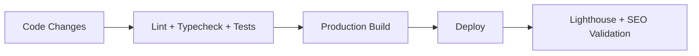

# Architecture Overview

This project is a privacy-first, App Router-based diagnostics platform focused on user-visible networking, browser, and security context.

## System Shape

```mermaid
flowchart TD
  U[User Browser] --> P[Next.js App Router UI]
  P --> A[/api/ip Route Handler]
  A --> D[IP Detection + Validation]
  A --> R[Rate Limiter]
  A --> G[Optional Geo Provider]
  P --> B[Client Diagnostics Hook]
  B --> S[Same-Origin Security/Header Probe]
  B --> L[Local Permission + Capability Signals]
```

## Runtime Boundaries

- Server responsibilities:
  - Proxy-aware IP detection
  - Response shaping (`json` / `text`)
  - Rate limiting
  - Optional geolocation enrichment
- Client responsibilities:
  - Browser/network diagnostics
  - Permission state visibility (no permission prompts)
  - Local history and export/share UX

## Privacy Boundaries

- No analytics or trackers.
- No server-side persistence of user diagnostics/history.
- No fingerprint-hash generation (canvas/audio/webgl hashing excluded).
- Advanced diagnostics are user-controlled via UI toggle.

## SEO/Discoverability Layer

- Rich metadata in `src/app/layout.tsx`
- Crawl/preview assets:
  - `src/app/robots.ts`
  - `src/app/sitemap.ts`
  - `src/app/opengraph-image.tsx`
  - `src/app/twitter-image.tsx`

## Delivery and Quality Gates



## Collaboration Credit

Architectural direction and product intent by Isaac D'Césares.  
Implementation evolved through vibe coded collaboration with Codex (GPT-5).
